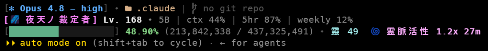

# cc-xp — turn your Claude Code usage into an RPG statusline

<div align="center">

[繁體中文](./README.md) ｜ [English]

</div>

---

Turn your **lifetime token usage** in Claude Code into XP: shows your level `Lv.`, a chūnibyō-style
Japanese title, and an XP bar — plus a layer of **靈力 (rei) RPG buff events** and a **cosmetics shop**.



<sub>(plain-text approximation)</sub>
```
[✻ Opus 4.8 (1M) - high] ⬩  my-project |  main
[🌌️ 夜天ノ裁定者] Lv. 168 ⬩ 4.9B | ctx 7% | 5hr 0% | weekly 0%
[████████░░░░░░░░░░░] 41.25% (180,394,788 / 437,325,491) ⬩ 靈 1,234 霊格:参  🌀 霊脈活性 1.2x 22m
```

## Core features

- **XP = your real claude-only lifetime token count** (recomputed via [`ccusage`](https://github.com/ryoppippi/ccusage)).
- RPG events only move a **separate currency, 靈力 (rei)** — they never touch the token-based XP display.

## Requirements

- `python3`
- [`ccusage`](https://github.com/ryoppippi/ccusage) (use `bunx ccusage` with no install, or `npm i -g ccusage`)
- A **Nerd Font** + an emoji-capable terminal (for icons)

## Install (one line)

**macOS / Linux**
```bash
bash <(curl -fsSL https://raw.githubusercontent.com/papaChong1229/cc-xp/main/install.sh)
```

**Windows (PowerShell)**
```powershell
irm https://raw.githubusercontent.com/papaChong1229/cc-xp/main/install.ps1 | iex
```

Both will do three things automatically:

1. **Download the script** to `~/.claude/cc-xp/`
2. **Write settings** — set up the `statusLine` and `UserPromptSubmit` hook in `~/.claude/settings.json`
   (backing it up to `settings.json.cc-xp.bak` first, keeping your existing settings)
3. **Set up the `cc-xp` command** — a shell alias on macOS/Linux; a `cc-xp.cmd` plus a PowerShell `$PROFILE` function on Windows

> Cross-platform note: the real installer logic is in Python (`cc-xp install`) and writes settings using
> `sys.executable` (an absolute interpreter path), so it never depends on `python3` being on `PATH`. The
> bootstrap only downloads + launches it.

After installing: **reopen your terminal** + **restart Claude Code**.
To **update**: just re-run the same line (it fetches the latest version; idempotent).

<details>
<summary>Alternative: install via the Claude Code plugin</summary>

```bash
/plugin marketplace add papaChong1229/cc-xp
/plugin install cc-xp@cc-xp
```

The plugin provides the `UserPromptSubmit` hook. But **a plugin cannot set `statusLine`**, so run the
installer once to wire statusLine + the command (the hook already comes from the plugin, so use `--no-hook`):

```bash
python3 "$(ls ~/.claude/plugins/cache/cc-xp*/plugins/cc-xp/scripts/xp-statusline.py | head -1)" install --no-hook
```
</details>

## Usage

```bash
cc-xp help                # list every command + explanation
cc-xp list                # what you own / have equipped / don't own yet
cc-xp shop                # the 靈力 shop + your balance
cc-xp buy bar_purple      # spend 靈力 to unlock a cosmetic
cc-xp equip bar_purple    # equip it
cc-xp unequip bar_theme   # unequip
cc-xp events off          # turn the whole RPG layer off (statusline becomes info-only)
```

## How it works

- **靈力 (rei)**: accrues per message (the `UserPromptSubmit` hook) based on your token delta; faster while a buff is active.
- **Anti-farming**: rolling a new event requires both "≥ 90 min since last roll" **and** "≥ 8 messages", with timestamps in global state — so nobody can farm 靈力 by spamming messages or new conversations.
- **Buff events** (v1): no event / 霊脈活性 1.2x / 凪 1.1x / 冥月 1.5x / 狂乱 2.0x.
- **Shop + 霊格 (reikaku)**: 靈力 is mainly spent on cosmetics (title variants / icon variants / bar themes / effects), and your total 靈力 earned auto-ranks you up through 霊格 tiers.
- **Data**: state lives in `~/.claude/statusline/.cc-xp.dat` (base64 + HMAC signature; hand-edits are reset). Everything is local; nothing is uploaded.

## Customize

Open the constants block at the top of `~/.claude/cc-xp/xp-statusline.py` to tweak any of these:

- **`TITLES`** — the title + variant pool for each level (the chūnibyō titles).
- **`BUFFS`** — the buff event pool: each event's probability, multiplier, and duration.
- **`SHOP`** — the 靈力 shop items and their prices.
- **`REI_RATE`** — how fast 靈力 accrues (rei earned per token).
- **`BAR_THEMES`** — color themes for the XP bar.
- **`C_*`** — colors for each part of the statusline (ANSI / 256-color).
- **`LINE_SPACING`** — how many blank lines to insert between the three lines (`0` = compact).
- **`F` / `A` / `R`** — the leveling-curve parameters that set the XP required per level.

## Roadmap

### Shipped
- ✅ Lv. / chūnibyō title / XP bar, XP = claude-only lifetime tokens
- ✅ 靈力 RPG **buff events** + dual-gate anti-farming (cooldown + activity)
- ✅ 靈力 **shop** (title variants / icon variants / bar themes / effects) + auto **霊格** ranks
- ✅ Event toggle, light anti-tamper (signed state), one-line install / update

### Future roadmap
- ⏳ **Quest events**: "consume X tokens within Y minutes → reward 靈力 / unlock", success/fail on expiry
- ⏳ **Gacha**: spend 靈力 to roll cosmetics, with duplicate protection
- ⏳ **靈力 as event fuel**: spend 靈力 to re-roll / guarantee a buff
- ⏳ More buff types and titles / seasonal cosmetics
- ⏳ Line 1 layout tweaks

Open an issue to request features, or send a PR (see [CONTRIBUTING](./CONTRIBUTING.en.md)).

## License

MIT
